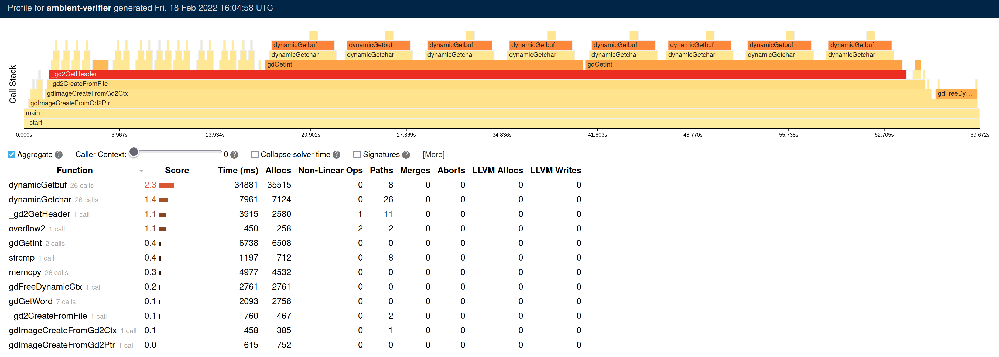

Overview
========

The ambient tool is a static binary verification tool for proving that weird machines in programs do (or do not) execute without errors under a variety of environmental conditions.

See the requirements and design documents in the ``doc`` directory for more details on the motivation and structure of the verifier:

- `Requirements <doc/Requirements.rst>`_
- `Design <doc/Design.rst>`_

Building
========

The verifier is built with the GHC Haskell compiler (versions 8.8 and 8.10). To get the compiler, use your distribution packages or the `ghcup tool <https://www.haskell.org/ghcup/>`_::

  ghcup install ghc 8.10.5
  ghcup install cabal 3.4.0.0

To build the verifier, first clone this repository and then::

  cd verifier
  ln -s cabal.project.dist cabal.project
  cabal configure -w ghc-8.10.5 pkg:ambient-verifier
  cabal build pkg:ambient-verifier

Running
=======

Functionality in the verifier is broken into subcommands:

- ``verify``: Verify a given binary with inputs satisfies verification
  conditions
- ``test-overrides``: Run tests present in user override files

More details on available options for the top level verifier, as well as the
various subcommands can be found using ``--help``::

  cabal run exe:ambient-verifier -- --help
  cabal run exe:ambient-verifier -- verify --help
  cabal run exe:ambient-verifier -- test-overrides --help

To run the verifier's test suite, run::

  cabal run test:ambient-tests

To record the results of a test suite run to a ``junit.xml`` file, run::

  cabal run test:ambient-tests -- --xml=junit.xml

Profiling
---------

The verifier includes functionality for profiling its performance. To generate
a profiling report, pass ``--profile-to <DIR>`` to an invocation of ``verify``.
This will generate a ``<DIR>/profile.html`` file that can be viewed in a web
browser. The data that this HTML file presents will be periodically regenerated
as the verifier runs on the program. A typical example looks like:

The profiling report presents a hierarchical view of the functions that are
invoked during the simulation of a program. The x-axis represents the time,
and the y-axis shows the call stack depth, counting from zero at the bottom.
Each stack frame is given a score based on some simulator heuristics (the time
spent simulating it, its number of allocations, its numbers of merges, etc.).
Generally speaking, the higher the score, the more likely it is to be a
performance bottleneck.

Docker
------

There is also a nightly Docker image that gets built after each commit to the
``master`` branch. To run the verifier through Docker, take a verifier command
and replace the ``cabal run exe:ambient-verifier --`` bit with
``docker run artifactory.galois.com:5017/nightly``::

  docker run artifactory.galois.com:5017/nightly --help
  docker run artifactory.galois.com:5017/nightly verify --help
  docker run artifactory.galois.com:5017/nightly test-overrides --help

The verifier's test suite can also be run through Docker, although it requires
changing the entrypoint to use ``ambient-tests`` instead::

  docker run --entrypoint ambient-tests artifactory.galois.com:5017/nightly

To record the results of a test suite run to a ``junit.xml`` file, run::

  docker run --entrypoint ambient-tests --volume $(pwd):/test-output artifactory.galois.com:5017/nightly --xml=/test-output/junit.xml

The ``--volume $(pwd):/test-output`` mounts the current directory to
``/test-output`` in the container so that when the test suite records the
results to ``/test-output/junit.xml``, the ``junit.xml`` file is copied back
to the current directory on your host machine.

User-specified Function Overrides
=================================

When verifying programs, it is almost always useful to be able to stub out program functionality that is not important for the verification.  For example, one may want to turn calls to ``printf`` into no-ops to significantly speed up verification.  Normally, these function overrides are written in Haskell; this is expressive, but not user friendly (end users are unlikely to know Haskell or to have a Haskell build environment available).

To better support end users, and enable faster experimentation, ``ambient-verifier`` supports a concrete syntax for overrides that is based on a simple s-expression grammar.  The concrete syntax is documented in the `crucible-syntax <https://github.com/GaloisInc/crucible/blob/master/crucible-syntax/README.txt>`_ repository.  In addition to the base constructs provided by the core concrete syntax, ``ambient-verifier`` supports additional primitives.  A directory containing overrides can be specified to the verifier using the ``--overrides`` command line option.

Example::

  (defun @padd ((p1 Pointer) (p2 (Bitvector 64))) Pointer
    (start start:
      (let res (pointer-add p1 p2))
      (return res)))

The ``overrides`` directory contains various overrides that we have curated for particular applications.

Directory Conventions
---------------------

The ``--overrides <DIR>`` option expects the name of a directory ``DIR`` whose
contents look like: ::

  DIR/
  ├── function/
  │   ├── fun1.cbl
  │   ├── fun2.cbl
  │   └── ...
  └── overrides.yaml (optional)

The ``function`` subdirectory contains ``.cbl`` files, where each ``.cbl`` file
is named after the function that should be overridden. For instance,
``printf.cbl`` would correspond to an override for the ``printf`` function.

The ``overrides.yaml`` is an optional file that can be present if one desires
more fine-grained control over which functions in a binary should receive
particular overrides. The contents of an ``overrides.yaml`` file will look
like this: ::

  function address overrides:
    main.exe:
      0x123: "foo"
      0x456: "bar"
      ...
    libc.so:
      0x123: "baz"
      0x456: "quux"
      ...

Here, ``function address overrides`` specifies an optional mapping from function
addresses to override names. This can be useful for situations where a function
in a binary has no corresponding symbol name (for instance, as in stripped
binaries). A separate mapping is specified for each binary or shared library.
The name that each address maps to must correspond the name of a ``.cbl`` file
in the ``function`` subdirectory.

Note that the mapping only cares about the file names of each binary and does
not care about the parent directories. For example, if the verifer is invoked
on ``/foo/bar/main.exe``, then the ``overrides.yaml`` only needs to specify
``main.exe``, not its full path.

Override Precedence
-------------------

Override names that appear in ``function address overrides`` take precedence
over other overrides. To illustrate how this works, suppose a user specifies
``--overrides DIR``, where the contents of ``DIR`` are the following: ::

  DIR/
  ├── function/
  │   ├── foo.cbl
  │   └── bar.cbl
  └── overrides.yaml

Where the contents of ``overrides.yaml`` are as follows: ::

  function address overrides:
    main.exe:
      0x123: "bar"

Now suppose that the verifier encounters a function in ``main.exe`` at address
``0x123`` named ``foo``. Although there is a ``foo.cbl`` override present, the
``function address overrides`` mapping also maps the address ``0x123`` to
``bar``. In such situations, the ``function address overrides`` take higher
precedence, so the verifier will use the ``bar`` override.

Functions
---------

Each ``<name>.cbl`` file is expected to define a function named ``@<name>``.
For instance, an ``add_bvs.cbl`` file should define an ``@add_bvs`` function,
e.g.: ::

  (defun @add_bvs ((x (Bitvector 32)) (y (Bitvector 32))) (Bitvector 32)
    (start start:
      (let sum (+ x y))
      (return sum)))

A ``.cbl`` file is also permitted to define other functions. These functions
are considered local to the ``.cbl`` file and are not visible to other files.
For instance, an alternative way to implement ``add_bvs.cbl`` would be: ::

  (defun @add_bvs ((x (Bitvector 32)) (y (Bitvector 32))) (Bitvector 32)
    (start start:
      (let res (funcall @add_bvs_2 x y))
      (return res)))

  ; Local to this file
  (defun @add_bvs_2 ((x (Bitvector 32)) (y (Bitvector 32))) (Bitvector 32)
    (start start:
      (let sum (+ x y))
      (return sum)))

A ``.cbl`` file is allowed to invoke functions defined in other ``.cbl`` files
by way of *forward declarations*. A forward declaration states the type of a
function that is not defined in the file itself, but will be provided later by
some other means. For instance, suppose that ``@add_bvs_2`` were defined in its
own ``.cbl`` file and that you want to invoke it from ``add_bvs.cbl``. To do
so, one must declare ``add_bv_2``'s type using a forward declaration in
``add_bvs.cbl``: ::

  (declare @add_bvs_2 ((x (Bitvector 32)) (y (Bitvector 32))) (Bitvector 32))

  (defun @add_bvs ((x (Bitvector 32)) (y (Bitvector 32))) (Bitvector 32)
    (start start:
      (let res (funcall @add_bvs_2 x y))
      (return res)))

The verifier will ensure that the invocation of ``add_bvs_2`` will be resolved
to the same function defined in ``add_bvs_2.cbl``. The verifier will raise an
error if it cannot find a function of the same name, or if it finds a function
with a different type than what is stated in the forward declaration.

Currently, forward declarations can be resolved to overrides defined in other
``.cbl`` files as well as overrides that are built into the verifier (e.g.,
the override for ``memcpy``). Note that forward declarations cannot be used to
resolve functions that are local to a particular ``.cbl`` file. Resolving
forward declarations to functions defined in binaries is not currently
supported.

Types
-----

One main type addition is for representing pointers:

- ``Pointer``

Unlike C/C++, these pointers are untyped and essentially correspond to ``uint8_t*``.

``ambient-verifier`` also adds a few wrappers around ``Bitvector`` types for portability and convenience:

- ``Byte`` is an alias for ``Bitvector 8``.
- ``Int`` is an alias for ``Bitvector 32``.
- ``Long`` is an alias for ``Bitvector 32`` on Arm32 and ``Bitvector 64`` on X86_64.
- ``PidT`` is an alias for ``Bitvector 32``.
- ``SizeT`` is an alias for ``Bitvector 32`` on Arm32 and ``Bitvector 64`` on X86_64.
- ``UidT`` is an alias for ``Bitvector 32``.

Operations
----------

The extra operations supported in ``ambient-verifier`` are:

- ``bv-typed-literal :: Type -> Integer -> Bitvector w`` where the first argument is a ``Bitvector`` type alias (see the Types section), the second argument is the value the ``Bitvector`` should contain, and ``w`` is the number of bits in the returned ``Bitvector`` (will match the width of the ``Type`` argument).
- ``make-null :: Pointer`` returns a null pointer.
- ``pointer-add :: Pointer -> Bitvector w -> Pointer`` where ``w`` is the number of bits in a pointer (usually 32 or 64).
- ``pointer-diff :: Pointer -> Pointer -> Bitvector w`` where ``w`` is the number of bits in a pointer (usually 32 or 64).
- ``pointer-sub :: Pointer -> Bitvector w -> Pointer`` where ``w`` is the number of bits in a pointer (usually 32 or 64).
- ``pointer-eq :: Pointer -> Pointer -> Bool``.
- ``pointer-read :: Nat -> Endianness -> Pointer -> Bitvector w`` where the first argument is the size of the read in bytes, the second argument is ``le`` or ``be``, and ``w`` is the size of the read in bits (will match the ``Nat`` argument).
- ``pointer-write :: Nat -> Endianness -> Pointer -> Bitvector w -> Unit`` where the first argument is the size of the write in bytes, the second argument is ``le`` or ``be``, and ``w`` is the size of the write in bits (must match the ``Nat`` argument).

Global Variables
----------------

Overrides may declare global variables using ``defglobal`` at the top level::

  (defglobal $$varname Type)

The verifier permits global variable declarations anywhere in the top level,
including after their use sites.  Currently global variables are scoped to the
files they are declared in, but `we plan to expand global variable scope to
cover all override files soon
<https://gitlab-ext.galois.com/ambient/verifier/-/issues/52>`_.

The verifier instantiates global variables as fresh symbolic values.  To change
the value of a global variable, use ``set-global!``::

  (set-global! $$varname value)

Tests
-----

Crucible syntax files may optionally contain functions starting with ``@test_``
that use ``assert!`` to test the behavior of an override.  Under normal
operation the verifier ignores these test functions, but when run with the
``test-overrides`` subcommand the verifier will execute any test functions it
finds and report test results.  The ``test-overrides`` subcommand has two
mandatory options:

- ``--overrides`` must point to the directory containing crucible syntax
  overrides.
- ``--abi`` must be either ``X86_64Linux`` or ``AArch32Linux``.  This flag
  sets the ABI to use when interpreting crucible syntax overrides.  For
  example, using the ``X86_64Linux`` will cause the verifier to execute
  function override tests using the X86_64 ``Bitvector`` type aliases.

Limitations
===========

The verifier only supports statically linked programs and standalone position independent executables (PIEs) that do not make use of procedure linkage tables (PLTs) (`related issue <https://gitlab-ext.galois.com/ambient/verifier/-/issues/6>`_). Moreover, the implementations of the ``_start()`` function in ``glibc`` (`related issue <https://gitlab-ext.galois.com/ambient/verifier/-/issues/22>`_) and ``musl`` (`related issue <https://gitlab-ext.galois.com/ambient/verifier/-/issues/23>`_) gives the verifier trouble. To work around these issues, it is recommended that you:

1. Implement a custom ``_start()`` function in your binary like so::

     void _start(void) {
       main();
     }

   While this is too simple of an implementation of ``_start()`` for actually running the binary, it avoids the complexities of ``_start()``'s actual implementation in ``glibc`` and ``musl``.
2. Compile the binary with the following flags::

   $ ${CC} -static -nostartfiles -no-pie foo.c -o foo.exe

   While the ``-static`` and ``-no-pie`` flags are not strictly necessary (the
   verifier supports PIEs without PLTs), compilers sometimes generate PLTs for
   more complicated PIEs.  Therefore, we recommend ``-static`` and ``-no-pie``
   when possible because they are more likely to produce a binary that the
   verifier can reason about.
